# E444-F2024-PRA2

This repo is a clone of https://github.com/miguelgrinberg/flasky 

## Flask

### Exercise 1: 
Recreate Example 2-1
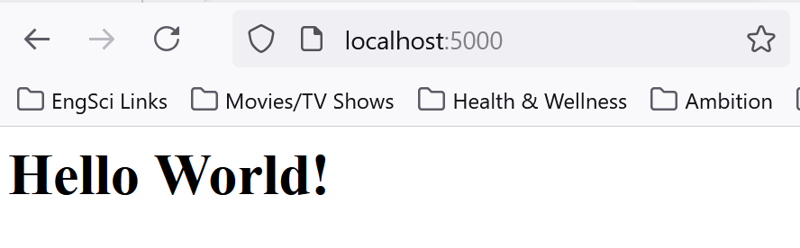

### Exercise 2: 
Recreate Example 2-2 
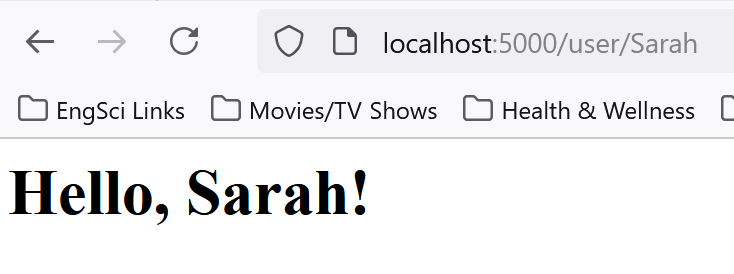

### Exercise 3:
Recreate Example 3
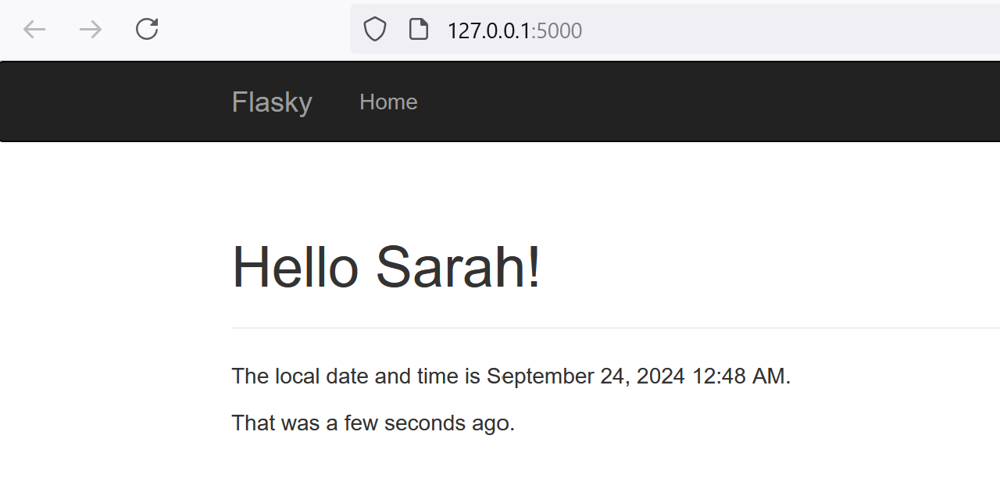

### Exercise 4: 
Recreate Example 4-7
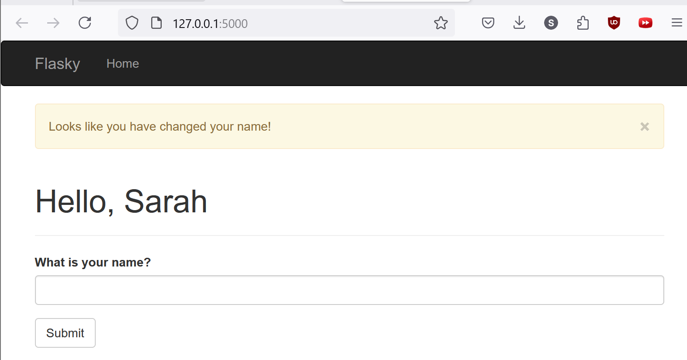

Rework Example 4-7 

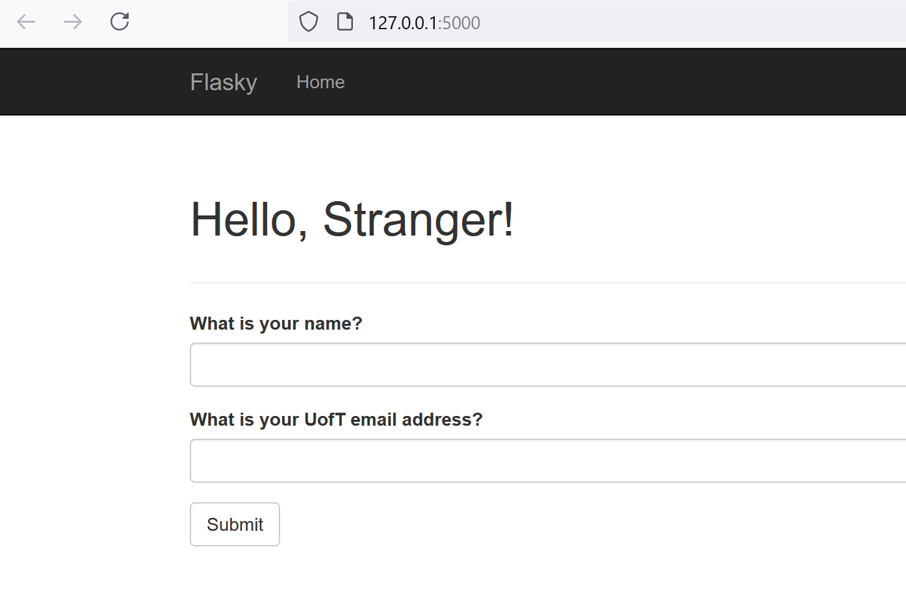

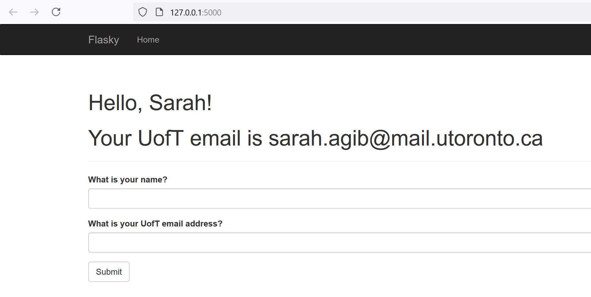

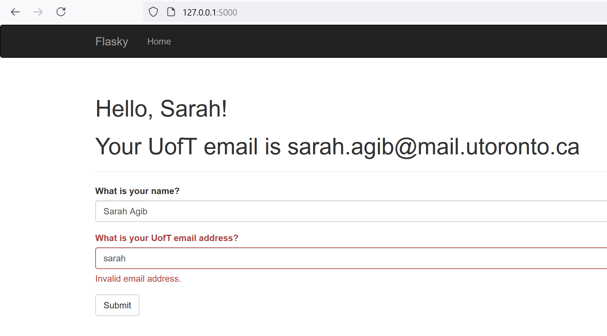

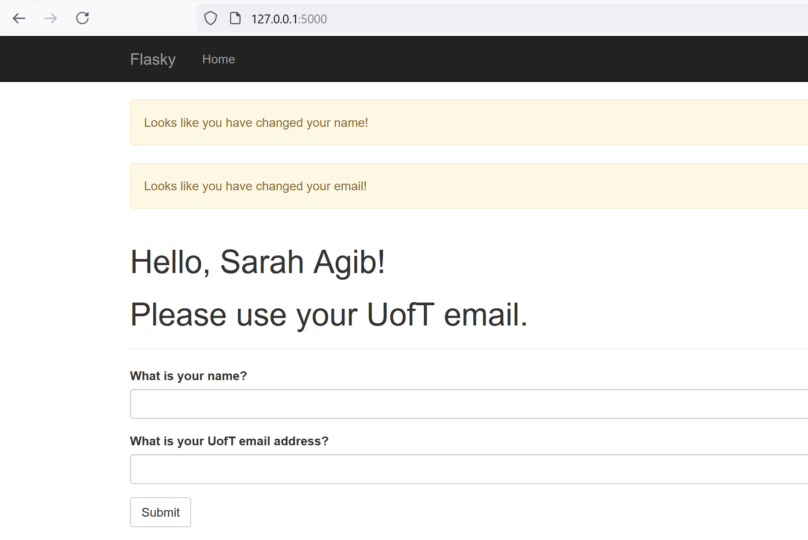

## Docker 

Docker Installation Version 

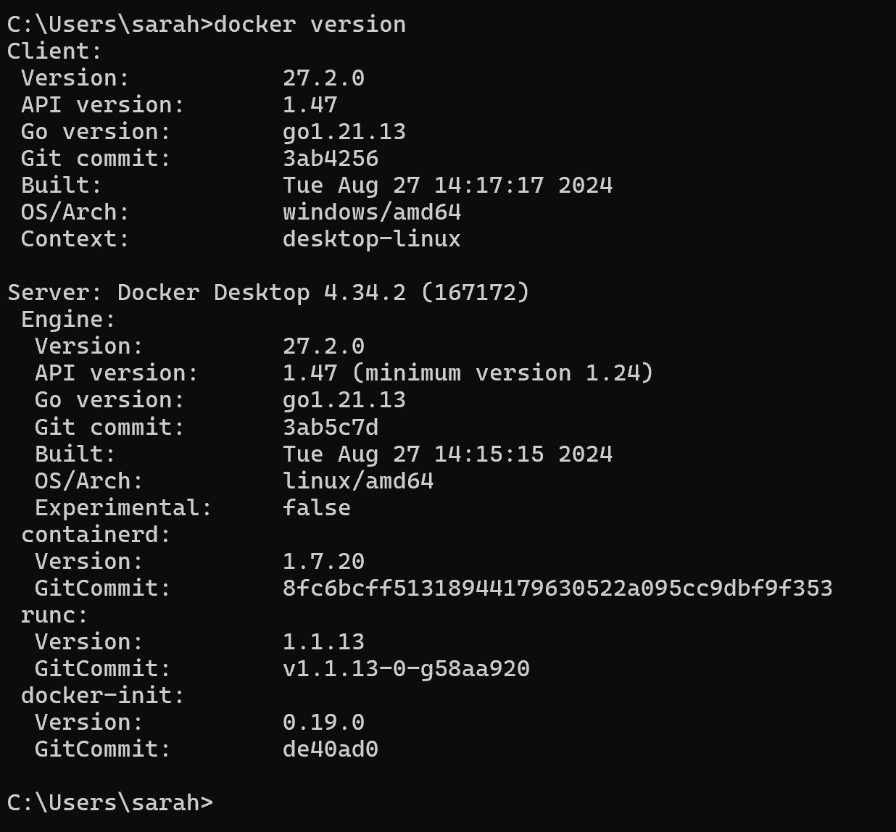

Running hello.py using docker 

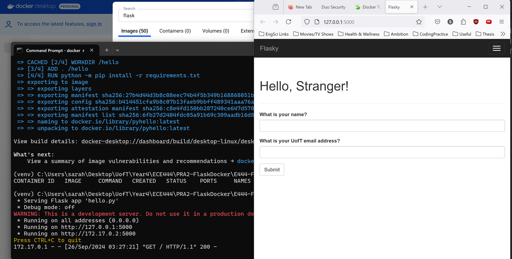

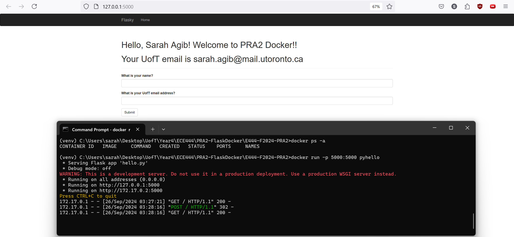
